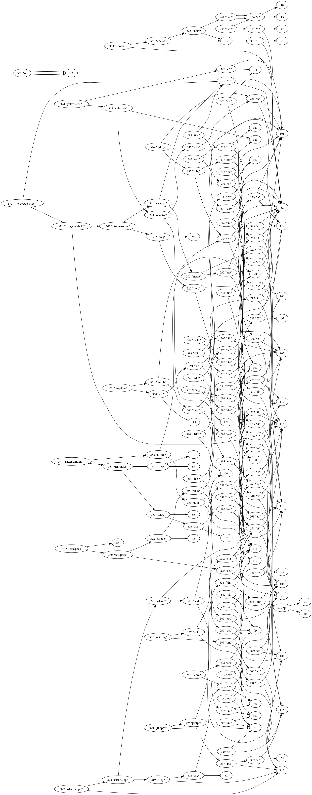

# Bpe-rust

Byte pair encoding test in Rust

Inspired by [this video](https://www.youtube.com/watch?v=6dCqR9p0yWY&ab_channel=TsodingDaily).

## Constructing a "Syntax tree" with BPE

This is a "syntax tree" of this README.md generated by BPE and rendered by graphviz.

## How to run

* Install rust.
* `cargo r --release -- README.md -t out.dot` to generate the dot file
* `dot -Tpng >out.png` to generate the graph visualization with graphviz

I also added `data/island3.cpp` (a file from [VastSpace](https://github.com/msakuta/VastSpace/blob/master/mods/vastspace/island3.cpp), one of the longest hand-written single file by me) so you can check if the encoding preserves information of a somewhat large file with the steps below.

* `cargo r --release -- data/island3.cpp`
* `cargo r --release -- data/island3.cpp.dat -o data/island3.cpp.dat.decoded`
* `diff data/island3.cpp data/island3.cpp.dat.decoded`
